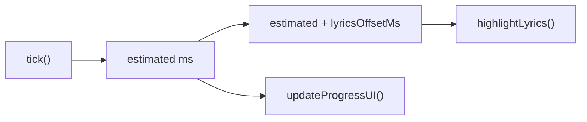

# Lyrics Sync Offset Controls

## How it works

The animation loop in [app.js](spotify-karaoke/app.js) calculates an `estimated` playback position (line 286) and passes it to `highlightLyrics(estimated)`. We introduce a `lyricsOffsetMs` variable that gets added to `estimated` before it reaches the highlight logic. This shifts which lyric line/word appears "active" without touching the Spotify playback position or the progress bar UI.

The progress bar continues to show actual playback time; only highlighting is shifted.

## Changes

### 1. HTML -- add offset control bar ([index.html](spotify-karaoke/index.html))

Add a new `div#lyrics-offset` inside the `lyrics-wrapper`, positioned as a sibling to the `lyrics-source` badge (bottom-left). It contains:

- Buttons: **-1s**, **-0.5s**, a **reset** label showing the current offset (e.g. `0.0s`), **+0.5s**, **+1s**
- Starts with class `hidden`; shown/hidden by JS based on `syncType`

Placement: bottom-left of the lyrics area (mirroring the `lyrics-source` badge on the bottom-right).

### 2. CSS -- style the offset controls ([style.css](spotify-karaoke/style.css))

- Position `absolute`, `bottom: 0.75rem; left: 0.75rem` (mirrors lyrics-source on the right)
- Small pill-shaped buttons using existing `--surface-overlay`, `--text-dim`, `--text-secondary` variables so it works in both light and dark mode automatically
- Compact sizing to stay unobtrusive (similar scale to the lyrics-source badge)

### 3. JS -- offset state and logic ([app.js](spotify-karaoke/app.js))

- **New state variable**: `let lyricsOffsetMs = 0;` in the State section (near line 53)
- **DOM ref**: grab `#lyrics-offset` and its child elements
- **`tick()` function** (line 282): pass `estimated + lyricsOffsetMs` to `highlightLyrics()` instead of raw `estimated`. The `updateProgressUI()` call remains unchanged (actual playback time)
- **`adjustOffset(deltaMs)` function**: adds `deltaMs` to `lyricsOffsetMs`, updates the label, and forces `lastHighlightedIndex = -1` so highlighting re-evaluates immediately
- **Show/hide logic**: in `fetchAndSetLyrics`, after setting `syncType`, show the offset bar if `syncType` is `WORD_SYNCED` or `LINE_SYNCED`, hide otherwise
- **Reset on track change**: set `lyricsOffsetMs = 0` in `fetchAndSetLyrics` when a new track loads
- **Button event listeners**: wire up click handlers for -1s, -0.5s, +0.5s, +1s buttons