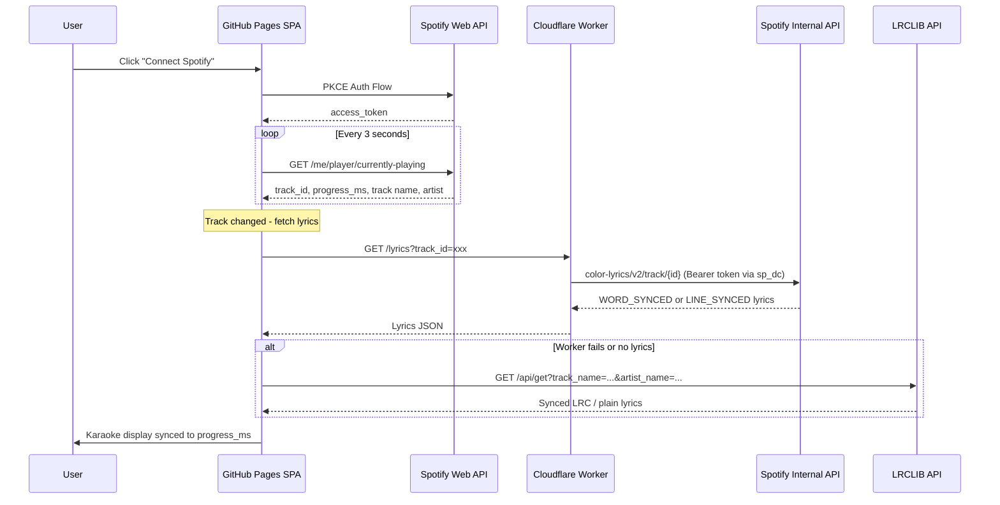

# Spotify Karaoke Lyrics Website

## Architecture Overview

A GitHub Pages SPA (frontend) + a free Cloudflare Worker (lyrics proxy). The frontend handles Spotify auth and playback polling; the worker securely fetches lyrics from Spotify's internal API using your `sp_dc` cookie.




## Two-Layer Lyrics Strategy

### Primary: Cloudflare Worker + sp_dc (best quality)

- **Endpoint (worker)**: `GET https://your-worker.workers.dev/lyrics?track_id={spotify_track_id}`
- **Internal Spotify endpoint**: `https://spclient.wg.spotify.com/color-lyrics/v2/track/{track_id}?format=json&vocalRemoval=false`
- **Auth**: Worker uses `sp_dc` cookie (stored as Worker secret) to obtain a Bearer token from `https://open.spotify.com/get_access_token`
- **Returns two sync types**:
  - `WORD_SYNCED`: per-word timestamps (`startTimeMs`, `endTimeMs` for each word) -- true karaoke
  - `LINE_SYNCED`: per-line timestamps (`startTimeMs` + full line text) -- good karaoke
- **Coverage**: Excellent (Spotify's own Musixmatch-powered database)

### Fallback: LRCLIB (free, no auth, direct from browser)

- **Endpoint**: `GET https://lrclib.net/api/get?track_name={name}&artist_name={artist}&duration={seconds}`
- **Search fallback**: `GET https://lrclib.net/api/search?q={track name} {artist}`
- **Returns**: `syncedLyrics` (LRC line-timed) and/or `plainLyrics`
- **No API key**, CORS-enabled, called only when track changes

### Graceful degradation chain

1. Word-synced (from Worker) -- each word highlights as sung
2. Line-synced (from Worker or LRCLIB) -- each line highlights when active
3. Plain lyrics (from LRCLIB) -- scrollable text, no auto-scroll
4. "No lyrics available" message

## Spotify Web API (Now Playing)

- **Endpoint**: `GET https://api.spotify.com/v1/me/player/currently-playing`
- **Auth**: PKCE flow (no client secret, works from static site)
- **Scopes**: `user-read-currently-playing`, `user-read-playback-state`
- **Key fields**: `item.id`, `item.name`, `item.artists[].name`, `item.album.images[0].url`, `item.duration_ms`, `progress_ms`, `is_playing`
- **Polling**: Every 3 seconds; interpolate between polls with `requestAnimationFrame`
- **Dev Mode limits (Feb 2026)**: Requires Premium, max 5 authorized users. Fine for personal use.

## Cloudflare Worker Implementation (`worker.js`)

~40 lines of code:

1. Receive `GET /lyrics?track_id=xxx` from frontend
2. Call `https://open.spotify.com/get_access_token` with `sp_dc` cookie to get Bearer token (cache token until expiry)
3. Call `https://spclient.wg.spotify.com/color-lyrics/v2/track/{track_id}?format=json&vocalRemoval=false` with Bearer token and `app-platform: WebPlayer` header
4. Return lyrics JSON to frontend with CORS headers
5. `sp_dc` stored as a Cloudflare Worker secret (never exposed to frontend)

## Karaoke Display Logic

### Word-synced mode (best experience)

- Each line rendered as a series of `<span>` elements (one per word)
- `requestAnimationFrame` loop: compute estimated position = `last_progress_ms + (Date.now() - last_poll_time)`
- Words whose `startTimeMs <= position` get highlighted with a CSS class
- Current line auto-scrolls to center; smooth transition on word highlights
- CSS: highlighted words glow/change color with a brief transition

### Line-synced mode

- Each line is a single element
- Same interpolation logic, but highlighting is per-line
- Current line: large + bright; past lines: dimmed; future lines: semi-transparent

### Interpolation accuracy

- Spotify's `progress_ms` is authoritative; local `Date.now()` drift is corrected on each poll
- When `is_playing` is false, freeze the interpolation timer

## UI Design

- **Dark theme** with subtle gradient background (music/karaoke vibe)
- **Top bar**: album art thumbnail, track name, artist, animated progress bar
- **Center area**: lyrics with the current line/word highlighted, smooth auto-scrolling
- **CSS transitions**: 150ms for word highlights, 300ms for line transitions, smooth scroll behavior
- **Responsive**: works on desktop and mobile
- **States**: "Connect to Spotify" landing, "Nothing playing", "No lyrics available", active karaoke

## File Structure

```
repo/
  index.html        -- Single page shell
  style.css         -- Dark karaoke theme + animations
  app.js            -- Spotify auth, polling, lyrics fetch, karaoke display
  worker/
    worker.js       -- Cloudflare Worker source (lyrics proxy)
    wrangler.toml   -- Cloudflare Worker config
  README.md         -- Setup instructions (Spotify app, Cloudflare Worker, sp_dc)
```

## Setup Steps (One-Time)

### Spotify App

1. Go to [Spotify Developer Dashboard](https://developer.spotify.com/dashboard), create an app
2. Set redirect URI to `https://<username>.github.io/<repo>/` (and `http://localhost:8080/` for local dev)
3. Copy the **Client ID** into `app.js`

### Cloudflare Worker

1. Install Wrangler CLI: `npm install -g wrangler`
2. `cd worker && wrangler login`
3. Set sp_dc secret: `wrangler secret put SP_DC` (paste your cookie value)
4. Deploy: `wrangler deploy`
5. Note the worker URL (e.g. `https://spotify-lyrics.your-subdomain.workers.dev`), set it in `app.js`

### Get sp_dc cookie

1. Open incognito tab, log into [open.spotify.com](https://open.spotify.com)
2. DevTools > Application > Cookies > `sp_dc` -- copy value
3. Close tab **without logging out** (keeps cookie valid ~1 year)

### GitHub Pages

1. Push repo to GitHub
2. Settings > Pages > Deploy from main branch

